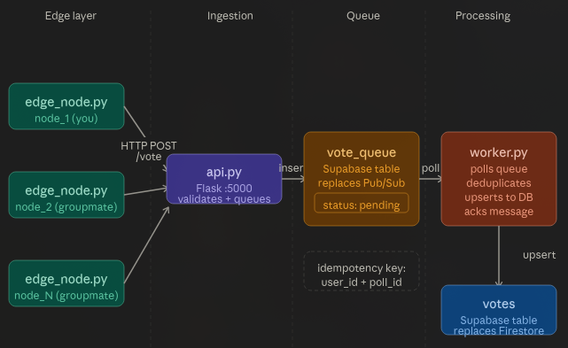

# Distributed Voting System
### CS323 — Lab Activity 2
**Group Members:** [Member 1] · [Member 2] · [Member 3] · [Member 4] · [Member 5]

---

Here's the flow:

```
[Edge Node 1] ──┐
[Edge Node 2] ──┤
[Edge Node 3] ──┼──▶ [Flask API] ──▶ [vote_queue table] ──▶ [Worker] ──▶ [votes table]
[Edge Node 4] ──┤    (ingestion)      (message queue)       (processing)  (final storage)
[Edge Node 5] ──┘
```
---

## Live API Endpoint

```
https://api-dkw2.onrender.com/
```

---

## Files in this repo

```
distributed-voting/
├── api.py              # Flask API — this is the one we deployed
├── worker.py           # Processes the queue, runs locally
├── edge_node.py        # Generates and sends votes, each member runs their own
├── requirements.txt    # Install these before running anything
└── README.md           # You're reading it
```

---

## Architecture Diagram



---

## How to set it up

You'll need Python 3.10+, a free Supabase account, and Git.

### 1. Clone the repo
```bash
git clone https://github.com/your-group/distributed-voting.git
cd distributed-voting
```

### 2. Activate the virtual environment and install dependencies
```bash
source my_project/bin/activate        # Linux/Mac
my_project\Scripts\activate           # Windows

pip install -r requirements.txt
```

### 3. Set up your .env file
```bash
cp .env.example .env
```

Open `.env` and fill in your Supabase credentials:
```
SUPABASE_URL=https://your-project-id.supabase.co
SUPABASE_KEY=your-service-role-secret-key
API_URL=https://your-deployed-api-url.onrender.com
```

> If API is running the API locally instead of using Render, just set `API_URL=http://localhost:5000`.

### 4. Create the tables in Supabase
Go to your Supabase project → **SQL Editor → New Query**, paste this in, and hit run:

```sql
-- stores the final processed votes
CREATE TABLE votes (
  id TEXT PRIMARY KEY,
  user_id TEXT NOT NULL,
  poll_id TEXT NOT NULL,
  choice TEXT NOT NULL,
  timestamp FLOAT NOT NULL,
  node_id TEXT,
  processed_at TIMESTAMPTZ DEFAULT NOW()
);

-- acts as the message queue between API and worker
CREATE TABLE vote_queue (
  id BIGSERIAL PRIMARY KEY,
  user_id TEXT NOT NULL,
  poll_id TEXT NOT NULL,
  choice TEXT NOT NULL,
  timestamp FLOAT NOT NULL,
  node_id TEXT,
  status TEXT DEFAULT 'pending',
  created_at TIMESTAMPTZ DEFAULT NOW()
);
```

---

## Running it

You'll need 3 terminals open. Make sure you've activated the venv in each one.

**Terminal 1 — the API:**
```bash
python3 api.py
```

**Terminal 2 — the worker:**
```bash
python3 worker.py
```

**Terminal 3 — your edge node:**
```bash
python3 edge_node.py
```

Before you run `edge_node.py`, open the file and change `NODE_ID` to your own name:
```python
NODE_ID = "node_juan"   # put your name here
```

Each member does this on their own machine. All 5 of us point to the same deployed API and Supabase project, so our votes all end up in the same database.

---

## Fault Injection Tests

This is the part where we break things on purpose to see what happens.

### Test 1 — Duplicate votes
Open `edge_node.py` and change the last line to:
```python
run_edge_node(duplicate=True)
```

This sends the same vote 3 times in a row. The point is to check if the idempotency key works — and it does. The `vote_queue` table gets 3x the messages, but the `votes` table only ever has one record per vote because `user_id + poll_id` is the unique key. No duplicates make it through.

---

### Test 2 — Killing the worker
Hit `Ctrl+C` on Terminal 2 to stop the worker. Leave the API and edge nodes running.

What you'll see:
- The API keeps accepting votes like nothing happened
- `vote_queue` starts filling up with `pending` rows
- `votes` table stops updating
- Nothing crashes — the system just waits

This is the whole point of decoupling ingestion from processing. One piece breaks and the rest keeps going.

---

### Test 3 — Bringing the worker back
Just restart it:
```bash
python3 worker.py
```

It'll immediately start chewing through all the queued messages. The `votes` table catches up on its own — you don't have to do anything manually. All the votes that piled up while the worker was down get processed cleanly.

---

## Evaluation

### Latency
Every vote has a `timestamp` from when it was generated. The worker also prints `time.time()` when it processes each one. Comparing those two values across 10+ samples gives you a rough end-to-end latency estimate.

### Throughput
Compare these three numbers after a run:
- How many votes `edge_node.py` says it sent
- How many rows are in `vote_queue`
- How many rows are in `votes`

Under normal operation they should all be close. During a worker outage, `vote_queue` grows while `votes` stays put. After recovery, `votes` catches up.

### Consistency
The system uses eventual consistency — the final state converges correctly even if things are temporarily out of sync. The idempotency key makes sure duplicates don't sneak into the final dataset no matter how many times the same vote gets delivered.

### Trade-offs we noticed

| Decision | Good part | Not-so-good part |
|---|---|---|
| Queue between API and worker | Worker can go down without losing data | Adds a bit of delay |
| Idempotency via upsert | No duplicate votes ever | Slightly more work per write |
| Random delays on edge nodes | Feels like a real distributed system | Throughput is hard to predict |
| Worker polls every 2 seconds | Dead simple, very reliable | Not instant — ~2s lag per message |

---

## Individual Reflections

### [Jealry Pulpul]
When I started this activity I was not sure what to expect. At first it was confusing. I did things. Helped set up the environment ran the edge node and checked if votes showed up in Supabase. I had to understand the system, not just one part. That was the part. No single script was difficult. Figuring out how they all worked together was. I wondered why the API did not write directly to the votes table. Why was there a queue in between? It took a while to understand.

The fault injection test helped me understand. We killed the worker. Let the edge nodes keep running. I expected something to break. Nothing did. The API kept accepting votes. The queue kept filling up. The votes table was frozen. There were no errors or crashes. The queue held everything together while one part of the system was down. When we restarted the worker it processed all the votes on its own. I had read about fault tolerance. Seeing it work was different. It made me understand why distributed systems are built this way. They are not simpler. Failures are less catastrophic.

### [Alfer Saculinggan]
This activity helped me understand distributed systems. We connected edge nodes, Cloud Run, Pub/Sub and Supabase into one system. I learned how edge nodes generate votes and send them to the cloud for processing and storage. 

During testing I saw that the system kept running even when some parts failed. Pub/Sub stored messages until the worker service was active again. I learned about retries and duplicate checking to prevent data loss and repeated records in Supabase. One challenge was configuring cloud services. Fixing errors, between the API, worker service and database. The processes happen asynchronously. This activity improved my understanding of cloud computing, distributed systems. Fault tolerance. I gained hands-on experience building and testing a system.

### [Ravien Glanida]
This activity allowed me to acquire a deeper insight into how distributed systems operate in practice rather than just theoretically. It is quite difficult to grasp at first since there were a large number of services involved – the edge nodes, Cloud Run, Pub/Sub, Supabase, among others. However, the hardest thing about it was to realize how all these components interact with each other asynchronously.

When working on this task, one of the most critical aspects that I observed was fault tolerance. When I was testing the voting system by disabling the worker service, I found that the rest of the system kept on accepting the vote and storing it in Pub/Sub. I initially believed that shutting down one service would lead to the complete failure of the system, however, the queued messages got processed automatically once the worker service resumed operations.

Furthermore, I learned the importance of retries and synchronization of services. Votes did not always show up instantaneously in Supabase which was rather confusing as well since the error may lie in any of the components. In conclusion, this activity enhanced my understanding of asynchronous processes and cloud-based architectures.

### [Mark Jason Usman]

Supabase was utilized as the main database of the distributed voting system for this laboratory activity. To be honest, it was slightly confusing since I was still new to this kind of system. Nonetheless, Supabase plays an essential role since it stores all the votes submitted from the worker service. The problem with the system is the data will not always be shown simultaneously since it operates asynchronously.

During the testing, what I observed was that although the worker service is turned off, the system will still accept votes because Pub/Sub will buffer the messages. Consequently, once the worker service was activated, the buffered messages will be instantly processed and stored in Supabase. For me, this result is astonishing since I was expecting that the entire system would shut down once one of the components becomes unavailable.

The biggest challenge that I encountered was debugging the synchronization of the worker and Supabase. Some votes are not instantly showing makes me confused and I keep asking myself if I do something wrong. Although this activity was tough, but I really enjoyed doing it as a beginner because eventually, I started understanding how a distributed system works practically.

### [Sofia Belle Villarente]
This laboratory activity was helpful for me to get a better understanding of the workings of distributed systems although I was still a beginner in it. The problem that I experienced when doing the activity was that I found the system confusing since there were a number of different components involved such as Cloud Run, Pub/Sub, Supabase, and the edge nodes. I found it difficult to determine how the votes are sent to one service and then transferred to another service. Moreover, setting up the system was not easy since even a slight error in its configuration may lead to various bugs in the system.

What I learned while implementing the voting system was that distributed systems function very differently compared to traditional computer programs. While in normal software development all the processes are carried out step by step, this laboratory activity showed me that in the distributed systems everything is much more complicated due to the asynchronous processes and delays. Sometimes the messages and votes are sent instantly whereas in some cases due to Pub/Sub, the votes become delayed or stuck in the queue. However, even if one component is faulty, the entire system will not be shut down. When I disabled the worker service, the API accepted votes and then Pub/Sub stored the messages until the worker service gets active. Once it happened, the votes automatically got processed and saved to Supabase.

The biggest problem I encountered while doing the activity was debugging since I could not identify where exactly the bug is situated. Sometimes the issue was with the API, at others with Pub/Sub, and in some cases – with the worker service or Supabase connection itself. Nevertheless, this activity taught me the importance of fault tolerance, asynchronous processes, and message queues in distributed systems.

---
